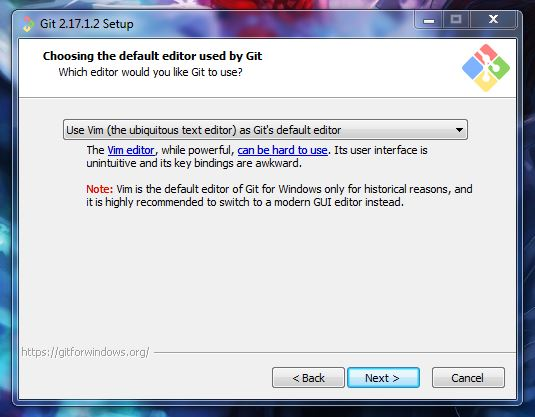

# Git Setup

## Installation

You can download Git from [here](https://git-scm.com/download/win) and run the installer to begin the installation.

Although you can keep the default settings for most of the steps, ensure you look through them carefully and modify the value of the dropdown list in the `Choosing the default editor used by Git` screen.



**If you miss this, you'll have to use VIM as your default editor** for adding a message to describe your changes, and this editor can be hard to handle for anyone who's not used to work with command line interfaces.

## Configure user data

Once Git has been successfully installed, the next step is to configure the user name and email which will be assigned to any of the changes to submit to your repositories.

In order to do this, **you should open** either the **command line interface** that Windows brings by default (_cmd_) or the one which is installed along with Git (_Git Bash_). The second one is recommended, although any of the two should work.

Use the following commands to configure your user data:

#### Name

```
git config --global user.name [your name]
```

#### Email:

```
git config --global user.email [your email address]
```

Keep in mind that **these two settings will be applied by default to any repository you work with** in the computer you're currently using.

If you want to set a different user name or email for a particular project, you can just remove the `--global` flag in the previous commands. This will override the default settings with an user name or email that will be used only for the repository you're currently working on.
