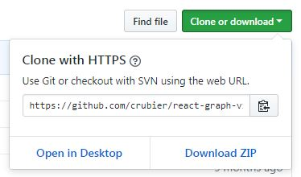

# Repository initialization

There are two ways to create a new Git repository in your computer.

## Create new local repository

If you want to create a new repository from scratch, the first step is to position yourself in the root folder of your working directory and run the following command:

```
git init
```

After you do that, your current directory will now be tracked by Git and you can perform any of the operations it comes with, such as saving your change sets and uploading them to a remote server.

### Link local project with a remote repository

It's okay to have a local project in order for you to keep a log of what you've done with the project and be able to go back to a past state whenever you need to, but it's always convenient to keep a copy on the internet so you can retrieve it from other computers or just have a backup in case something happens.

In order to do that, the first step is to create an empty project in a remote server such as [GitHub](https://github.com/), [BitBucket](https://bitbucket.org/) or [GitLab](https://gitlab.com/).

Once you've created it, you need to retrieve the URL of said repository, which can be easily done in services such as [GitHub](https://github.com/):



The next step is to run the `remote add` command in your console by using the URL you've just obtained:

```
git remote add origin [repository URL]
```

With this done, you now have linked your local project to the remote one you created on the cloud, meaning from here on you'll be able to upload your changes and keep an online backup for your project.

### Creating a `.gitignore` file

Although this step is optional, creating a `.gitignore` file is recommended in every new project you create.

This file allows you to specify a set of files or folders which should be ignored by Git and never be added to your change sets and, therefore, uploaded to a remote server.

It's a good practice to **use it for every file which includes sensible data** (such as passwords, for example) **or any auto-generated files** (such as the `node_modules` folder in any projects built with `npm` or the `build` directory for Java projects).

## Create a repository from an existing one

If you have an existing repository online in which you want to continue working on, the way to create a local instance of said repository is by using the `clone` command.

```
git clone [repository URL]
```

Make sure you're located in the folder in which you want your code to be before running this command, as it will automatically download all of the files in a new folder inside your current directory.

`clone` will create a copy of the remote repository, so besides of all of the code files, you'll also keep a log of all of the changes that have been done ever since it was created.

Keep in mind, though, that by default only the `master` branch will be downloaded. If you want to work in another of the branches in the remote project, you should use `fetch` to bring it back to your newly created local copy.

```
git fetch origin [remote branch name]:[local branch name]
```

In order to avoid confusion, it's recommended to use the same name for remote and local branches when running this command.
