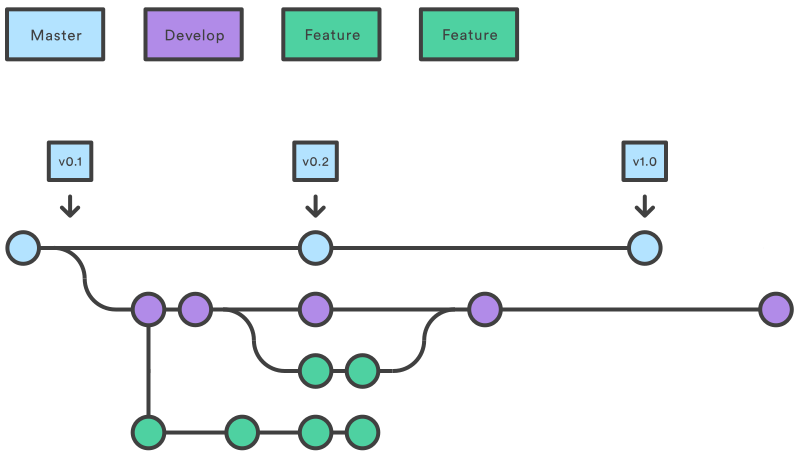

# Tips and good practices

## Recommended branch structure

There is a model to organize your branches which is commonly used and is one of the most efficient ways to work with.

In this model, you'll create a `develop` branch that has its roots in the `master` branch. From this one can emerge a lot of other branches, where each one will represent a new feature for the application. Once the feature is finished, its branch should be merged into `develop` and be removed from the tree.

The `master` branch will only be used to store stable versions of the application, so no commits should ever be submitted to it. Instead, all of the fixes or features should always be included into `develop` until we reach a point in which a new version of the application is ready to be released. When it is, we will merge `develop` contents into `master`.

The reason why we should not work directly in `master` is that this is the default branch from which every user will download our application. **If we were to add features that are still in progress, it could break the application for our final users.** Since we can't afford this to happen in any application that is already published, we should use `develop` as the default branch to work with unless we want to perform a release that's ready to see the light.

In summary, this is what each of the forementioned branches is about:

* `master` should contain **stable versions of the application** which will be available to final users. It should never be modified directly.

* `develop` is the branch in which all of the developers would merge their work and get the application ready for upcoming releases.

* Feature branches will be born from the `develop` branch and will be used to develop a single feature. Once the feature is complete, its contents should be merged into `develop`.

## Generic tips

* **Make small commits for specific tasks**, rather than huge ones that modify a dozen of files.

* **Synchronize with the remote repository often**, which will save everyone from having to face terrifying merge conflicts.

* **Never rewrite history** by modifying a commit that has already been sent to the remote repository, as this will cause conflicts to other developers who may have already downloaded it.

* **Use master branch only for stable versions** of your project.

* **Remove feature branches once you're done with them**, if the feature has already been merged to `develop` and / or `master` branches.

* If possible, always **write your commit messages in english**, so more people will be able to read and contribute to your project repository.

* **Always include auto-generated files in .gitignore file**, because they would fill our repository with unwanted and useless commits.

* **Do not create a branch for each person in the project** and use feature branches instead. A branch with your name does not say anything about what you're doing, and third parties watching your repository will get no information out of it either.

* **Create a new tag whenever you publish a new version**, so you can easily track which was the last commit associated to said release.
